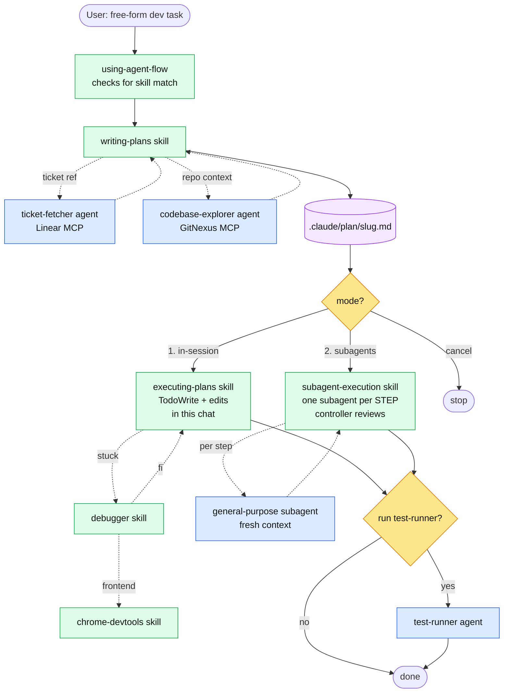

# agent-flow

A skill-driven dev workflow for Claude Code (and opencode): **describe → plan → pick mode → execute → test**. No orchestrator, no forced human checkpoints. Skills trigger on intent and hand off to each other.

## Why

Ad-hoc agentic coding skips planning, over-scopes, and silently pushes code. `agent-flow` adds:
- A **plan file on disk** (`.claude/plan/{slug}.md`) as the single source of truth between planning and execution
- **Self-triggering skills** — `writing-plans` fires when you describe a dev task, then chains to whichever execution mode you pick
- **Two execution modes** — in-session (watch every edit) or subagent-driven (one fresh subagent per STEP, main chat stays light)
- **A shared `debugger` skill** the executor loads when stuck, instead of guessing

## Flow



Legend: 🟢 skills · 🔵 sub-agents · 🟡 user choice · 🟣 artifact on disk

## Components

### Skills

| Skill | Role |
|---|---|
| `skills/using-agent-flow/SKILL.md` | Meta. Enforces "check for a flow skill before responding or editing on any dev task." |
| `skills/writing-plans/SKILL.md` | Gathers ticket + repo context via sub-agents, writes `.claude/plan/{slug}.md`, self-reviews, ends with the mode handoff. |
| `skills/executing-plans/SKILL.md` | **Mode 1 — in-session.** Critically reviews the plan, TodoWrite from STEPS, executes each step in the current chat, loads `debugger` on errors. |
| `skills/subagent-execution/SKILL.md` | **Mode 2 — subagent-driven.** Controller reads plan + owns todo. Dispatches a fresh general-purpose subagent per STEP with precisely scoped context, reviews the report, moves on. |
| `skills/debugger/SKILL.md` | Diagnostic methodology + routing by symptom. Invoked by the executor when stuck. |

### Sub-agents

| Agent | Role | Used by |
|---|---|---|
| `agents/ticket-fetcher.md` | Fetch a Linear ticket, return a short summary | `writing-plans` |
| `agents/codebase-explorer.md` | Map relevant symbols/files via GitNexus, detect guideline skills | `writing-plans` |
| `agents/test-runner.md` | Typecheck + delegate browser checks to `chrome-devtools` | `executing-plans`, `subagent-execution` (at end, optional) |

### `debugger` skill references

`skills/debugger/references/` — typecheck, lint, lsp, runtime-errors, console-logging, chrome-mcp. See `skills/debugger/SKILL.md` for routing.

## Plan artifact

A single markdown file at `.claude/plan/{slug}.md`.

- `{slug}` = lowercased Linear ticket id (e.g. `eng-123`) if present, else a short kebab-case slug (≤ 40 chars, no dates).
- Sections: `GOAL`, `APPROACH`, `SKILLS TO APPLY`, `FILES TO CHANGE`, `STEPS` (checklist), `TESTS TO UPDATE/ADD`, `RISKS`, `OUT OF SCOPE`.
- Every STEP starts with `- [ ]` — the executor builds its todo from these.
- On change requests, `writing-plans` overwrites the same file. No `v2`.

## How skills trigger

There is no orchestrator. The skills chain themselves:

1. You describe a dev task → Claude Code's skill matcher fires `using-agent-flow` (meta) which checks whether `writing-plans` applies. For any non-trivial code task, it does.
2. `writing-plans` runs → writes the plan → prints the handoff block.
3. You pick `1` or `2` → that skill fires and executes.
4. Executor ends by offering `test-runner`.

You can also invoke any skill directly:

```
/write-plan add rate limiter to login endpoint
/execute-plan .claude/plan/eng-482.md
```

## Install

### As a Claude Code plugin (recommended)

The repo ships its own single-repo marketplace (`.claude-plugin/marketplace.json`), so two commands install it:

```bash
claude plugin marketplace add anthonyespirat/agent-flow
claude plugin install agent-flow@agent-flow-marketplace
```

Or from inside a Claude Code session:

```
/plugin marketplace add anthonyespirat/agent-flow
/plugin install agent-flow@agent-flow-marketplace
```

Uninstall:

```bash
claude plugin uninstall agent-flow
```

### Manual copy (no plugin system)

Claude Code:

```bash
cp -r skills/* ~/.claude/skills/
cp agents/*.md ~/.claude/agents/
```

opencode:

```bash
cp -r skills/* ~/.config/opencode/skill/
# opencode agents live in a different layout — adapt as needed
```

## Prerequisites

- **Linear MCP** — for `ticket-fetcher` (optional, only if you use Linear refs)
- **GitNexus MCP + indexed repo** — `codebase-explorer` requires it; run `npx gitnexus analyze` in the project first
- **chrome-devtools skill** — used by `test-runner` and referenced by `debugger` for frontend checks
- **TypeScript project** — `test-runner` defaults to `tsc --noEmit`

## Usage

Just describe the task — `using-agent-flow` + `writing-plans` trigger automatically:

```
add a rate limiter to the login endpoint
```

or with a ticket:

```
ENG-482
```

The flow: plan is written, you're shown a summary + the path + two mode options. Reply `1` or `2`.

## Design principles

- **Skills, not orchestration.** Each skill knows what comes next. No top-level router.
- **Plan on disk, not in context.** Survives compaction; reviewable in your editor.
- **Choice of isolation.** In-session for feedback fidelity, subagent-driven for big plans and context hygiene — you pick per task.
- **One todo, owned by the executor.** No double-tracking.
- **Debugger is a shared skill.** Any executor can load its methodology when stuck.
- **No destructive ops without explicit ask.** No commits, pushes, or PRs from skills or subagents.
- **Short reports.** Every agent caps output (~200–500 words). Raw dumps kill the controller's context.

## Repository layout

```
agent-flow/
├── .claude-plugin/
│   ├── plugin.json
│   └── marketplace.json
├── README.md
├── skills/
│   ├── using-agent-flow/SKILL.md
│   ├── writing-plans/SKILL.md
│   ├── executing-plans/SKILL.md
│   ├── subagent-execution/SKILL.md
│   └── debugger/
│       ├── SKILL.md
│       └── references/
│           ├── typecheck.md
│           ├── lint.md
│           ├── lsp.md
│           ├── runtime-errors.md
│           ├── console-logging.md
│           └── chrome-mcp.md
└── agents/
    ├── ticket-fetcher.md
    ├── codebase-explorer.md
    └── test-runner.md
```
