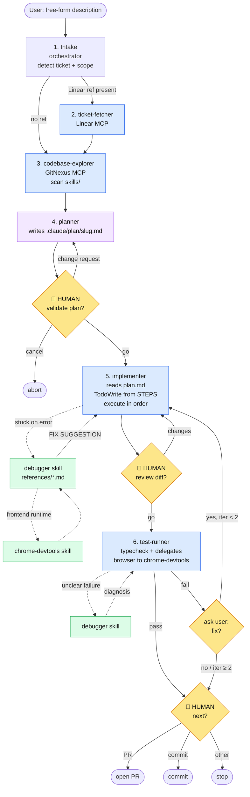

# agent-flow

Structured dev workflow for Claude Code (and opencode): **describe → plan → human-validate → implement → test → human-decide**. Heavy work is delegated to specialized sub-agents so the main conversation stays light.

## Why

Ad-hoc agentic coding tends to skip planning, over-scope, and silently push code. `agent-flow` adds:
- A **plan file on disk** (`.claude/plan/{slug}.md`) as the single source of truth between planning and execution
- **Hard human checkpoints** at plan validation, code review, and decision points
- **Specialized sub-agents** with narrow tool sets and output contracts
- A **shared `debugger` skill** implementer and test-runner call when they get stuck — instead of guessing or flailing

## Flow



Legend: 🟡 human checkpoints · 🔵 sub-agents · 🟢 skills · ⚪ start/end

## Components

### Orchestrator skill

| Skill | Role |
|---|---|
| `skills/dev-flow/SKILL.md` | Main entrypoint. Routes each step to the right sub-agent and enforces checkpoints. |

### Sub-agents

| Agent | Role | Tools |
|---|---|---|
| `agents/ticket-fetcher.md` | Fetch a Linear ticket, return a short summary | `linear` |
| `agents/codebase-explorer.md` | Map relevant symbols/files via GitNexus, detect guideline skills | `gitnexus`, `Read` |
| `agents/planner.md` | Write `.claude/plan/{slug}.md` with GOAL/APPROACH/STEPS/RISKS | `Read`, `Write` |
| `agents/implementer.md` | Read plan, build todo via `TodoWrite`, execute STEPS in order | `Read`, `Edit`, `Write`, `Glob`, `Grep`, `TodoWrite`, `Bash`, `LSP` |
| `agents/test-runner.md` | Typecheck + delegate browser checks to `chrome-devtools` skill | `Bash`, `Read`, `chrome-devtools` |

### Shared skill

| Skill | Purpose |
|---|---|
| `skills/debugger/SKILL.md` | Diagnostic methodology + routing by symptom |
| `skills/debugger/references/typecheck.md` | TS compile errors (TS2322, TS2339, TS7006, …) |
| `skills/debugger/references/lint.md` | ESLint / Prettier |
| `skills/debugger/references/lsp.md` | `hover`, `goToDefinition`, `findReferences`, call hierarchy |
| `skills/debugger/references/runtime-errors.md` | Stack traces, reproduction, promise rejections |
| `skills/debugger/references/console-logging.md` | Diagnostic instrumentation (with removal discipline) |
| `skills/debugger/references/chrome-mcp.md` | Pointer to the existing `chrome-devtools` skill |

## Plan artifact

The plan is a single markdown file at `.claude/plan/{slug}.md` in the project's working directory.

- `{slug}` = Linear ticket id (lowercased, e.g. `eng-123`) if present, otherwise a short kebab-case slug.
- Format: `GOAL`, `APPROACH`, `SKILLS TO APPLY`, `FILES TO CHANGE`, `STEPS` (checklist), `TESTS TO UPDATE/ADD`, `RISKS`, `OUT OF SCOPE`.
- On change requests, the planner **overwrites** the same file — no stale versions.
- The implementer builds its todo from `STEPS` at the start of execution.

## Install

### Claude Code

```bash
# from the repo root
cp -r skills/dev-flow ~/.claude/skills/
cp -r skills/debugger ~/.claude/skills/
cp agents/*.md ~/.claude/agents/
```

### opencode

```bash
cp -r skills/dev-flow ~/.config/opencode/skill/
cp -r skills/debugger ~/.config/opencode/skill/
# opencode agents live in a different layout — adapt as needed
```

## Prerequisites

- **Linear MCP** — for `ticket-fetcher` (optional, only if you use Linear refs)
- **GitNexus MCP + indexed repo** — `codebase-explorer` requires it; run `npx gitnexus analyze` in the project first
- **chrome-devtools skill** — used by `test-runner` and referenced by `debugger` for frontend checks
- **TypeScript project** — `test-runner` defaults to `tsc --noEmit`

## Usage

Trigger from the main chat:

```
Use dev-flow: add a rate limiter to the login endpoint
```

or, with a ticket:

```
Use dev-flow: ENG-482
```

The orchestrator will announce the steps it will take and pause at each human checkpoint.

## Design principles

- **The orchestrator routes, sub-agents execute.** The main conversation never does raw exploration or editing itself.
- **Plan on disk, not in context.** The plan survives context compaction and can be reviewed by the human in their editor.
- **One todo, owned by the implementer.** Avoid double task tracking between orchestrator and worker.
- **Debugger is a shared skill, not an agent.** Any executor (implementer, test-runner) can load its methodology when stuck, without spawning a new process.
- **No destructive ops without explicit go.** Commit, push, and PR are after CP3, never before.
- **Short reports.** Every sub-agent caps output (200-500 words). Raw dumps kill the orchestrator's context.

## Repository layout

```
agent-flow/
├── README.md
├── skills/
│   ├── dev-flow/
│   │   └── SKILL.md
│   └── debugger/
│       ├── SKILL.md
│       └── references/
│           ├── typecheck.md
│           ├── lint.md
│           ├── lsp.md
│           ├── runtime-errors.md
│           ├── console-logging.md
│           └── chrome-mcp.md
└── agents/
    ├── ticket-fetcher.md
    ├── codebase-explorer.md
    ├── planner.md
    ├── implementer.md
    └── test-runner.md
```
