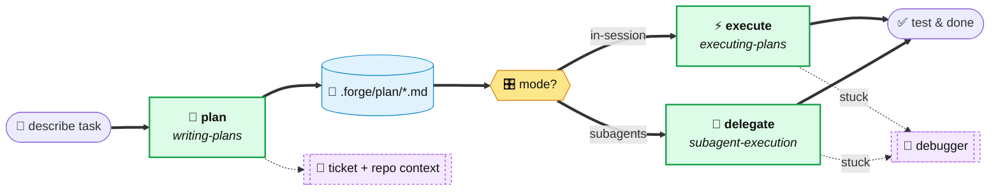

# forge

> ⚠️ **Alpha.** APIs, skill names, and the plan format may change without notice. Use on throwaway branches until it stabilizes.
>
> Currently biased toward **TypeScript** projects (typecheck defaults, suggested skills, assumed tooling). PRs welcome to make it language-agnostic.

A skill-driven dev workflow for **Claude Code** and **OpenCode**: **describe → plan → pick mode → execute → test**. No orchestrator. Skills trigger on intent and hand off to each other.

*Built by developers, for developers.*

## Design principles

- **Skills, not orchestration.** Each skill knows what comes next. No top-level router.
- **Plan on disk, not in context.** Survives compaction; reviewable in your editor.
- **Choice of isolation.** In-session for feedback fidelity, subagent-driven for big plans — you pick per task.
- **Shared debugger.** Any executor loads it when stuck.
- **No destructive ops without explicit ask.** No commits, pushes, or PRs from skills or subagents.
- **Short reports.** Subagent output capped (~150–500 words). Raw dumps kill context.
- **Per-subagent model selection by capability.** Match model tier to task complexity: fast/cheap for mechanical steps, standard for multi-file edits, most capable for architectural judgment. Platform-managed where not configurable.
- **🚀 [GitNexus](https://github.com/abhigyanpatwari/GitNexus) over grep.** Code exploration goes through the GitNexus knowledge graph — faster, more precise, and far cheaper in tokens than repeated file scans.
- **🦴 [Caveman](https://github.com/JuliusBrussee/caveman) for agent-to-agent.** Selected skills and sub-agents emit machine-consumed sections in caveman style — cuts the payload roughly in half while preserving signal.

## Flow



One path, two execution flavors. Context gathering and the debugger show up only when needed.

## Components

### Skills

| Skill | Role |
|---|---|
| `using-forge` | Entry gate — routes dev tasks into the flow. |
| `brainstorm` | On-demand grill — only runs when explicitly requested. |
| `writing-plans` | Gathers context, writes `.forge/plan/{slug}.md`. |
| `executing-plans` | Runs the plan in-session. |
| `subagent-execution` | Runs the plan via one subagent per STEP. |
| `debugger` | Diagnostic playbook, loaded on failure. |

### Sub-agents

| Agent | Role |
|---|---|
| `ticket-fetcher` | Pulls a Linear ticket summary. |
| `codebase-explorer` | Maps relevant files via GitNexus. |
| `test-runner` | Typecheck + optional browser check. |

## Plan artifact

A single markdown file at `.forge/plan/{slug}.md`.

- `{slug}` = lowercased Linear ticket id (e.g. `eng-123`) if present, else a short kebab-case slug (≤ 40 chars, no dates).
- Sections: `GOAL`, `APPROACH`, `SKILLS TO APPLY`, `FILES TO CHANGE`, `STEPS` (checklist), `TESTS TO UPDATE/ADD`, `RISKS`, `OUT OF SCOPE`.
- Every STEP starts with `- [ ]` — the executor builds its todo from these.
- On change requests, `writing-plans` overwrites the same file. No `v2`.
- Backward compatibility: if `.forge/` doesn't exist, fall back to `.claude/plan/` (Claude) or `.opencode/plan/` (OpenCode).

## How skills trigger

There is no orchestrator. The skills chain themselves:

1. You describe a dev task → the skill matcher fires `using-forge` (meta) which checks whether `writing-plans` or an executor applies.
2. `writing-plans` runs → writes the plan → prints the handoff block.
3. You pick `1` or `2` → that skill fires and executes.
4. Executor ends by offering `test-runner`.

`brainstorm` is available as a direct, on-demand skill when you explicitly want to grill an idea before planning. It is not part of the automatic default path.

You can also invoke any skill directly:

**Claude Code:**
```
/write-plan add rate limiter to login endpoint
/execute-plan .forge/plan/eng-482.md
```

**OpenCode:**
```
/skill using-forge add rate limiter to login endpoint
```

## Prerequisites

> These must be set up manually. The plugin installer does **not** handle them.

- **Linear MCP** — for `ticket-fetcher` (optional, only if you use Linear refs)
- **GitNexus MCP + indexed repo** — `codebase-explorer` requires it; run `npx gitnexus analyze` in the project first
- **[caveman](https://github.com/JuliusBrussee/caveman) skill** — agent-to-agent payloads (e.g. `codebase-explorer` → `writing-plans`) compress through it
- **chrome-devtools skill** — used by `test-runner` and referenced by `debugger` for frontend checks
- **TypeScript project** — `test-runner` defaults to `tsc --noEmit`

## Install

### Claude Code

**Plugin (recommended):**

The repo ships its own single-repo marketplace (`.claude-plugin/marketplace.json`):

```bash
claude plugin marketplace add anthonyespirat/forge
claude plugin install forge@forge-marketplace
```

Or from inside a Claude Code session:

```
/plugin marketplace add anthonyespirat/forge
/plugin install forge@forge-marketplace
```

Uninstall:

```bash
claude plugin uninstall forge
```

**Manual copy:**

```bash
cp -r skills/* ~/.claude/skills/
cp agents/*.md ~/.claude/agents/
```

### OpenCode

**Plugin (recommended):**

Add forge to the `plugin` array in your `opencode.json` (global or project-level):

```json
{
  "plugin": ["forge@git+https://github.com/anthonyespirat/forge.git"]
}
```

Restart OpenCode. The plugin auto-installs via Bun and registers all skills automatically.

Verify by asking: "Tell me about your forge skills"

**What the plugin does:**

1. **Auto-discovers skills** — the `config` hook injects the `skills/` directory into OpenCode's skill paths. No manual `cp` or symlinks needed.
2. **Injects bootstrap context** — the `experimental.chat.messages.transform` hook loads `using-forge` into every new session automatically. You don't need to invoke `/skill using-forge` manually.
3. **Preserves plan state** — the `experimental.session.compacting` hook saves forge workflow context across session compaction.

**As an npm plugin (alternative):**

```bash
npm install forge-opencode
```

```json
{
  "plugin": ["forge-opencode"]
}
```

**Manual copy (fallback):**

```bash
cp -r skills/* ~/.config/opencode/skills/
cp agents/*.md ~/.config/opencode/agents/
```

OpenCode does not have a separate agent directory concept — agents are dispatched via the `Task` tool. The `agents/*.md` files serve as prompt templates referenced by the skills.

## Usage

Just describe the task — `using-forge` + `writing-plans` trigger automatically:

```
add a rate limiter to the login endpoint
```

or with a ticket:

```
ENG-482
```

The flow: plan is written, you're shown a summary + the path + two mode options. Reply `1` or `2`.

## Repository layout

```
forge/
├── .claude-plugin/          # Claude Code plugin metadata
│   ├── plugin.json
│   └── marketplace.json
├── .opencode/               # OpenCode plugin (auto-discovery + bootstrap)
│   └── plugins/
│       └── forge.js
├── opencode-plugin/         # OpenCode npm package source
│   ├── package.json
│   ├── index.js
│   └── forge-plugin.js
├── README.md
├── skills/
│   ├── using-forge/SKILL.md
│   ├── brainstorm/SKILL.md
│   ├── writing-plans/SKILL.md
│   ├── executing-plans/SKILL.md
│   ├── subagent-execution/
│   │   ├── SKILL.md
│   │   ├── implementer-prompt.md
│   │   └── references/
│   │       ├── model-selection.md
│   │       ├── dispatch-loop.md
│   │       └── handling-status.md
│   └── debugger/
│       ├── SKILL.md
│       └── references/
│           ├── typecheck.md
│           ├── lint.md
│           ├── lsp.md
│           ├── runtime-errors.md
│           ├── console-logging.md
│           └── chrome-mcp.md
└── agents/
    ├── ticket-fetcher.md
    ├── codebase-explorer.md
    └── test-runner.md
```

## Inspiration

- [superpowers](https://github.com/obra/superpowers) — the original skill-driven workflow this project riffs on.
